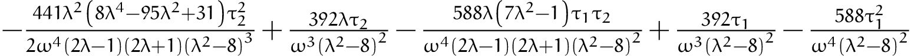

# [Birkhoff.py](https://github.com/yonesuke/Birkhoff.py)

Implementation of [Birkhoff normal form](https://encyclopediaofmath.org/wiki/Birkhoff_normal_form) in 
Python

## Example

For Hamiltonian


the point  is an equilibrium point.
By using [Birkhoff.py](https://github.com/yonesuke/Birkhoff.py), we can calculate the Birkhoff normal form as



See [shibayama2009.py](shibayama2009.py) for a detailed code.

## Installation
```bash
git clone https://github.com/yoensuke/Birkhoff.py
```

## Requirements

You will need
 `Python` 3
 `SymPy`

If you do not have `SymPy`, install it via pip.
```bash
pip3 install sympy
```
For another installation, check [here](https://docs.sympy.org/latest/install.html).

## Usage

Place [`Birkhoff.py`](Birkhoff.py) and [`Hamilton.py`](Hamilton.py) to a directory you work for.
For the rest, just bring Hamiltonian and its equilibrium point and mimic [shibayama2009.py](shibayama2009.py).


## [License](LICENSE)
[](https://opensource.org/licenses/MIT)
